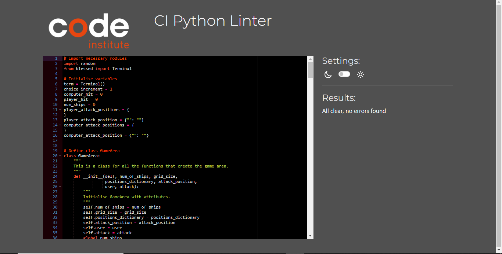

# Testing

Return back to the [README.md](README.md) file.

## Code Validation

## Python

I have used the recommended [PEP8 CI Python Linter](https://pep8ci.herokuapp.com) to validate all of my Python files.

| File | CI URL | Screenshot | Notes |
| --- | --- | --- | --- |
| run.py | [PEP8 CI](https://pep8ci.herokuapp.com/https://raw.githubusercontent.com/Briant-20/battleships/main/run.py) |  | All clear, no errors found |

## Defensive Programming

Defensive programming was manually tested with the below user acceptance testing:

| User Action | Expected Result | Pass/Fail | Comments |

| Enter either 1 2 or 3 to the terminal | Show the rules for 1 play the game for 2 and exit for 3 | Pass | Works as expected and resets if there is an invalid input | 

| User enters values for number of ships and grid size | Creates a grid with the specified size and number of ships | Pass | Stops the user from entering invalid inputs and from entering too many ships for the specified grid size | 

| User enters the x and y values for their ship coordinates| Display the ships on the grid to the user in their chosen position | Pass | Will only allow coordinates to be entered once and they must be within the grid space | 

| The user enters x and y values for the coordinates they wish to attack on the computers grid | A red X will appear in their chosen position on the computers grid if they miss the location of the computers ships and an orange * will appear if they chose the correct position | Pass | Will only allow coordinates to be entered once and they must be within the grid space | 